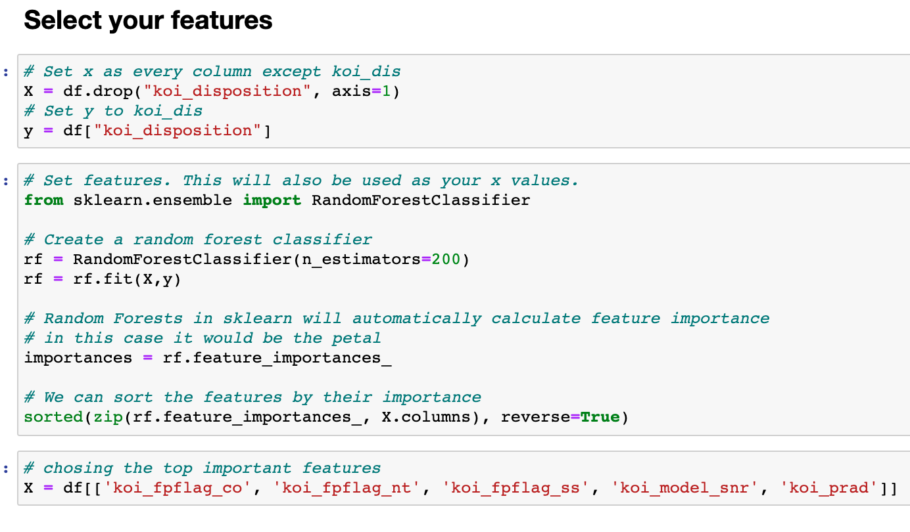
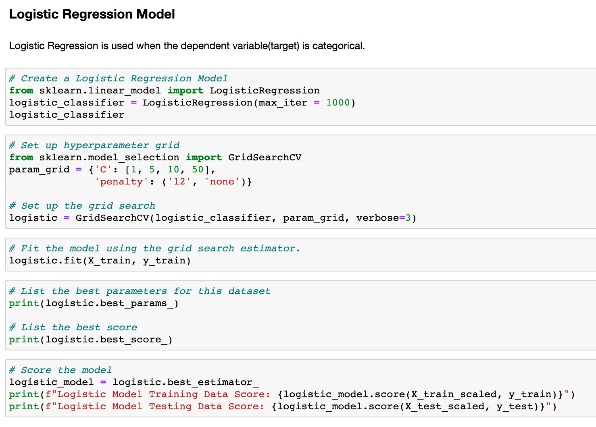
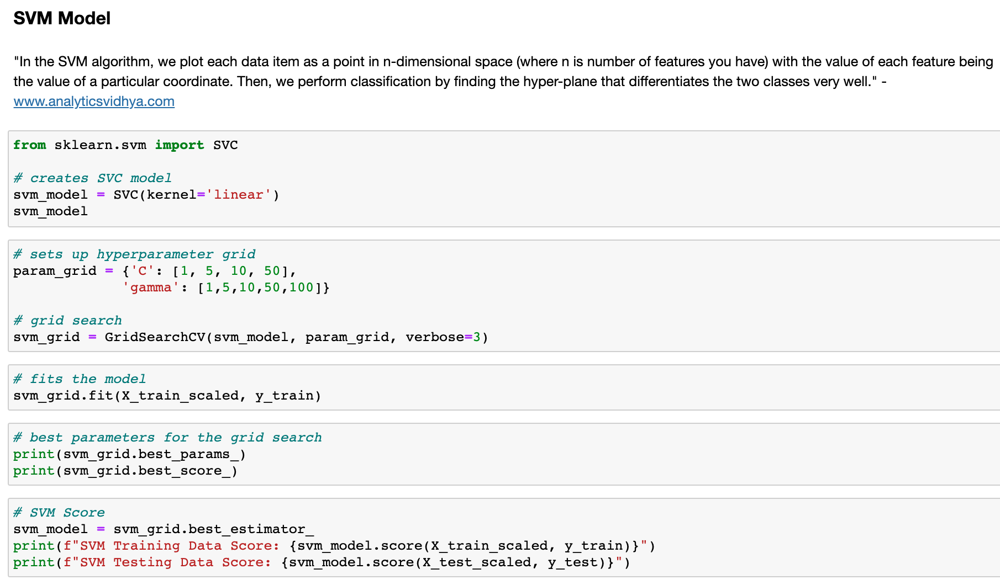
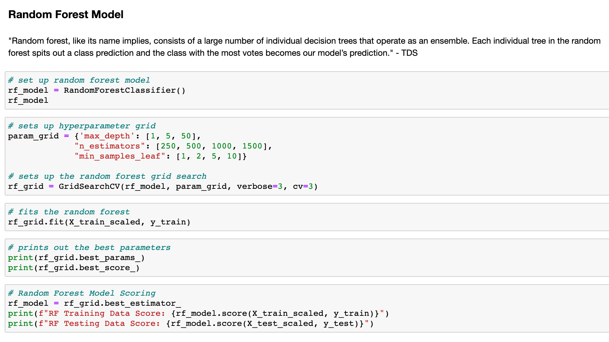
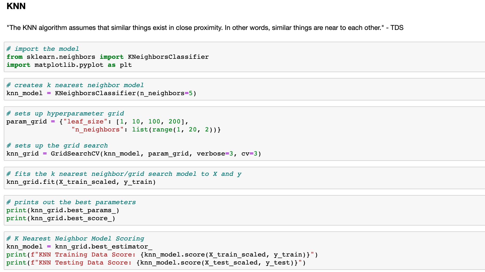
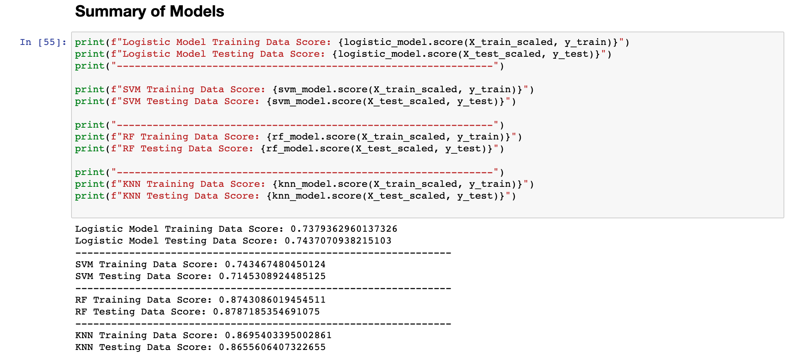

# Machine Learning Exoplanet Search

## Summary: 
A project aimed to compare different machine learning models in classifying planets outside our solar system. 

## Table of Contents
* [Technologies](#technologies)
* [Description](#description)
* [Developement](#development)
* [Models](#machine-learning-models)
* [Summary](#final-table)

## Technologies 
* Python
* Pandas
* Jupyter Notebook
* sci-kit learn

## Description
NASA Kepler space telescope has been searching for hidden planets outside of our solar system. This challenge's task was to create machine learning models capable of classifying candidate exoplanets from the raw NASA Kepler dataset. The data was first explored, cleaned and pre-processed and hyperparameter tuned so it was ready to be ran through 4 models: Logistic Regression, Random Forests, K Nearest Neighbors and Support Vector Machine Classifier. The best model turned out to be Random Forest Classifier with a score of 0.87. [Jupyter Notebook](https://nbviewer.jupyter.org/github/kasiakalemba/Machine-Learning-Basic-Skills/blob/master/exoplanet_models.ipynb)

## Development 
### Data cleaning and pre-processing
1. Data exoplanets on was imported from the following set: https://www.kaggle.com/nasa/kepler-exoplanet-search-results
  * There were no missing values in the data 
  * Only one column was an object, the rest were all numerical values 
  * Features were selected based on their feature importance 
  * A test-train split was created for the dataset
  * Lastly data was scaled using StandardScaler

  
### Machine Learning Models 
1. Logistic Regression: often used when data is categorical was a good starting point for the datset. It's testing data score was 0.743.

2. Support Vector Machine (SVM) model returned a score of 0.714

3. Random Forest Model consists of a large number of decision tres. For this dataset it gave a value of 0.879. 

4. K Nearest Neighbor (KNN) model assumes that if things are in proximity they should be similar to each other. In this case the final score was 0.865. 

#### Final Table 

